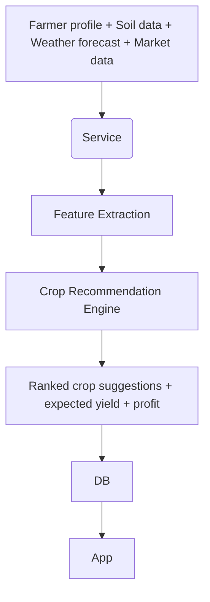

# EasyFarms — Technical Flowcharts & Implementation Plan

Ye document SIH 2025 ke liye EasyFarms ke **8 modules** ka technical flowchart aur implementation plan deta hai. Isme overall architecture, module-wise data flow, major components, APIs, aur sequence steps diye gaye hain.

---

## 1) Overall System Architecture (High-level)

```mermaid
flowchart TD
  subgraph U[Users]
    A[Farmer App (PWA / Mobile)]
    B[Extension: IVR / SMS / Field Agent App]
  end

  subgraph F[Frontend/API Layer]
    C[API Gateway / Load Balancer]
    D[Auth (Supabase/Firebase)]
    E[WebSocket / Push Notification Service]
  end

  subgraph S[Backend Services]
    G[Orchestration Service (Node/Python)]
    H[Module: Crop Planning]
    I[Module: Disease Detection]
    J[Module: Weather & Irrigation]
    K[Module: Market & Price]
    L[Module: Govt Schemes]
    M[Module: Input Advisor]
    N[Module: Chatbot (RAG)]
    O[Misc Services]
  end

  subgraph ML[ML & Data]
    P[Model Serving (TF/ONNX / TorchServe)]
    Q[Vector DB (Milvus / Pinecone / Weaviate)]
    R[Feature DB / Time-series DB]
  end

  subgraph D[Data Storage]
    S1[User DB (Supabase/Firebase)]
    S2[Object Storage (S3) - images/audio]
    S3[Relational DB - Postgres]
  end

  A --> C
  B --> C
  C --> D
  C --> G
  G --> H
  G --> I
  G --> J
  G --> K
  G --> L
  G --> M
  G --> N
  G --> O
  I --> P
  N --> Q
  H --> R
  AllDBS(S1 & S2 & S3) --> G
  P --> S2
  Q --> G

  style ML fill:#ffe0b2
  style S fill:#e3f2fd
  style U fill:#f1f8e9
```

---

## 2) Sequence: When a Farmer Uses the App (End-to-end)

1. Farmer opens app → app authenticates via **Supabase/Firebase**.
2. Farmer selects service (e.g., Disease Detection) or asks via voice chatbot.
3. App uploads image/audio to **Object Storage** and calls Orchestration Service.
4. Orchestration Service logs request, pushes job to worker (Celery / Cloud Tasks).
5. Worker calls appropriate module microservice (e.g., Disease Detection).
6. Model serving endpoint returns prediction → service formats human-friendly advice.
7. Advice stored in User DB + sent back to app via API response and push notification.
8. Chat logs, timestamps, and hints saved to Vector DB for later RAG retrieval.

---

## 3) Module-wise Flowcharts & Implementation

### A. Real-time Crop Health Monitoring (Disease Detection)

```mermaid
flowchart TD
  U[Farmer App uploads Image] --> |POST /detect| S(Orchestration)
  S --> Q[Preprocessor (resize, enhance)]
  Q --> M[Model Serving API (ONNX / TorchServe)]
  M --> R[Prediction (disease, severity, bbox)]
  R --> T[Rule Engine: map disease->treatment]
  T --> DB[Save: case + image in S3 + metadata]
  T --> RESP[Return advice + steps + caution]
  RESP --> A[Send notification to farmer]
```

**Tech notes:**

* Model: EfficientNet / MobileNet backbone exported to ONNX for mobile-friendly inference.
* Preprocessing: Auto-crop leaf area, color normalization.
* Rule Engine: JSON-driven mapping for pesticide & organic remedies (editable by agronomists).

---

### B. Crop Planning & Recommendation



**Tech notes:**

* Use tabular models (XGBoost / LightGBM) + rule-based constraints (crop rotation, sowing window).
* Soil: Accept manual entry or Soil Health Card API mapping.
* Output: provide 2–3 alternatives and confidence score.

---

### C. Weather & Irrigation Advisory

```mermaid
flowchart TD
  Scheduler(Cron) --> Fetcher[Weather API (IMD / OpenWeather)]
  Fetcher --> ForecastModel[Local Downscaling / Ensemble]
  ForecastModel --> IrrigationEngine[Water Scheduling Rules]
  IrrigationEngine --> Alerts(+App push / SMS / IVR)
```

**Tech notes:**

* Keep a small local model for short-term rainfall nowcasting.
* Provide irrigation calendar entries as reminders.

---

### D. Market & Price Advisory

```mermaid
flowchart TD
  Fetch[Agmarknet / Mandi APIs] --> Normalizer
  Normalizer --> TrendModel
  TrendModel --> SuggestionEngine
  SuggestionEngine --> App / Reports
```

**Tech notes:**

* Store time-series in InfluxDB or Postgres with time indices.
* TrendModel: Simple ARIMA / Prophet or LSTM for medium-term forecasts.

---

### E. Government Schemes & Financial Access

```mermaid
flowchart TD
  FarmerProfile --> EligibilityEngine
  EligibilityEngine --> SchemeDB[Govt Scheme DB]
  SchemeDB --> Suggestion
  Suggestion --> App (Apply / Guidance)
```

**Tech notes:**

* Scrape or integrate official scheme portals; normalize rules into a rule-engine.
* Provide pre-filled forms to reduce friction.

---

### F. Input & Resource Advisory

```mermaid
flowchart TD
  Crop + Soil + Stage --> InputAdvisor
  InputAdvisor --> FertRecommendation
  InputAdvisor --> VendorLocator
  VendorLocator --> App
```

**Tech notes:**

* Map inputs to local vendors; include low-cost & organic alternatives.

---

### G. AI Chatbot & Voice Assistant (RAG + TTS/STT)

```mermaid
flowchart TD
  App(User Query Text/Audio) --> STT(if audio)
  STT --> NLU[Intent + Entities]
  NLU --> RAG[Search Vector DB + Docs]
  RAG --> LLM[Response Generation]
  LLM --> TTS(if audio) --> App
  LLM --> Log to DB
```

**Tech notes:**

* Use open-source LLM (Llama-family) or hosted model. For factual answers use RAG against: crop guides, local manuals, govt docs.
* Vector DB: store FAQ, previous Q\&A, localized content.
* STT/TTS: Use offline-capable models or cloud TTS for better voice quality.

---

### H. Miscellaneous Services

* Crop calendar, reminders, digital crop diary, analytics dashboards for agronomists and admin.
* Field agent app for offline syncing and verification.

---

## 4) Data Flow & Integration Points (Summary)

* **External APIs:** IMD/OpenWeather, Agmarknet, Soil Health / Govt portals.
* **Storage:** S3 for images/audio, Postgres for relational data, Vector DB for RAG, Time-series DB for market/weather history.
* **Workers & Orchestration:** Celery / Cloud Tasks for heavy jobs (model inference, batch forecasting).
* **Security & Compliance:** Data encryption at rest/in transit, farmer consent for profiles & images, GDPR-like controls.

---

## 5) Deployment & Scaling Notes

* Containerize microservices (Docker + Kubernetes / Cloud Run).
* Use autoscaling for model serving and background workers.
* Use cost-optimized model serving (quantized ONNX, Triton) for production.

---

## 6) Acceptance Criteria (SIH / MVP)

* Disease detection accuracy >= 85% for top 10 target diseases.
* Crop recommendation yields realistic profit estimates within ±20%.
* Chatbot answers common farmer queries with >80% user-satisfaction (survey).
* Offline / SMS fallback works in low-connectivity areas.

---

## 7) Next Steps (Immediate Tasks)

1. Prepare dataset & baseline disease model (collect images + labels).
2. Prototype disease detection microservice with ONNX runtime.
3. Build simple PWA with image upload and chatbot text.
4. Integrate IMD / Agmarknet endpoints for demo.
5. Prepare SIH pitch deck with this flowchart + one demo video.

---

*Document prepared for EasyFarms — technical team & SIH 2025 submission.*
